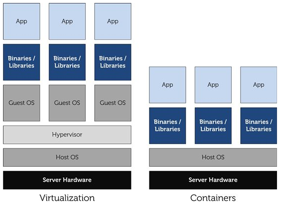

# Linux Container

LXC，其名稱來自Linux軟體容器（**Linux Containers**）的縮寫，一種**作業系統層虛擬化**（Operating system–level virtualization）技術，為Linux內核容器功能的一個用戶空間介面。

本身只提供**最小化程度的虛擬化**功能，並可利用cgroup與App Armor管理工具，來有效管理、控制，並隔離虛擬機與實體機的資源使用，且LXC不需要透過複雜程序，來解譯虛擬電腦與實體電腦之間 CPU 指令的運算，或是週邊裝置的虛擬化，簡單來說，Linux Container 就是可以直接使用實體電腦上的軟硬體資源，而最特別的地方，就是 Linux Container 與實體系統共享相同的核心與函式庫。



# Ubuntu 14.04 使用方式

**安裝**
```sh
sudo apt-get update
sudo apt-get install lxc
```

**建立一個Container :**
```sh
sudo lxc-create –n lxc-test
```
你可以下載[Ubuntu 14.04 minimal](http://images.linuxcontainers.org/)安裝於Container上。

**開啟一個Container :**
```sh
sudo lxc-start –n lxc-test –d
```

**查看資訊：**
```sh
sudo lxc-info –n lxc-test

Name:       lxc-test
State:      RUNNING
PID:        17954
IP:         10.21.20.156
CPU use:    2.18 seconds
BlkIO use:  160.00 KiB
Memory use: 9.13 MiB
```

**存取一個Container :**
```sh
#產生一個shell directly於Container
sudo lxc-attach -n lxc-test

#存取Cntainer的Console
sudo lxc-console -n lxc-test

#使用SSH 進入Container中
ssh ubuntu@10.21.20.156
```

**停止與刪除Container :**
```sh
sudo lxc-stop –n lxc-test
sudo lxc-destroy –n lxc-test
```

# 參考
* [Linux Container](http://tobala.net/download/lxc/ch01.pdf)
* [Linux Container教學](http://www.arthurtoday.com/p/virtualization.html#lxc)

