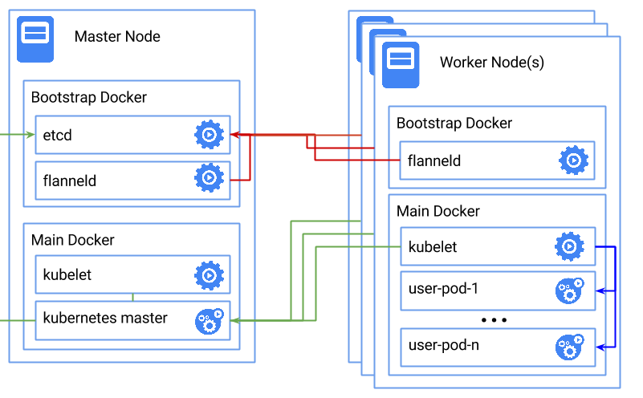

# Running Kubernetes Multi Node via Docker
本節將說明如何透過 docker 來部署一個多節點的 kubernetes。其架構圖如下所示：



### 事前準備
一個簡單的節點配置如下：

| IP Address |   Role     |
|------------|------------|
|172.16.1.100|  master    |
|172.16.1.101|  minion-1  |
|172.16.1.102|  minion-2  |

在開始安裝前，我們必須在部署的主機或虛擬機安裝安裝 docker ，執行以下指令：
```sh
$ curl http://files.imaclouds.com/scripts/docker_install.sh | sh
```

在每台節點下載 kubernetes 專案：
```sh
$ git clone https://github.com/kubernetes/kubernetes.git
```

### 佈署 Master 節點
首先透過設定環境參數來決定要佈署的 k8s 與相依套件版本，可以透過以下方式設定```(option)```：
```sh
export K8S_VERSION="1.2.0"
export ETCD_VERSION="2.2.1"
export FLANNEL_VERSION="0.5.5"
export FLANNEL_IFACE="eth0"
export FLANNEL_IPMASQ="true"
```
> 若要使用預設值，則可以忽略這部分。

接著進入部署目錄來進行部署動作，可以執行以下指令：
```sh
$ export MASTER_IP="<master_eth0_ip>"
$ cd kubernetes/docs/getting-started-guides/docker-multinode/
$ sudo ./master.sh
...
Master done!
```

當完成後，接著下載 kubectl 來使用 k8s 指令：
```sh
$ wget http://storage.googleapis.com/kubernetes-release/release/v${K8S_VERSION}/bin/linux/amd64/kubectl
$ chmod 755 kubectl
$ sudo ln kubectl /usr/bin/
```

上面完成後，我們要跟 k8s 的叢集連接，透過以下設定完成：
```sh
$ kubectl config set-cluster test-doc --server=http://localhost:8080
$ kubectl config set-context test-doc --cluster=test-doc
$ kubectl config use-context test-doc
```

當完成所有步驟後，可以透過簡單指令來檢查是否安裝與連接成功，如以下：
```sh
$ kubectl get nodes
NAME         STATUS    AGE
master       Ready     24m
```

### 佈署 Worker 節點
首先透過設定環境參數來決定要佈署的 k8s 與相依套件版本，可以透過以下方式設定```(option)```：
```sh
export K8S_VERSION="1.2.0"
export ETCD_VERSION="2.2.1"
export FLANNEL_VERSION="0.5.5"
export FLANNEL_IFACE="eth0"
export FLANNEL_IPMASQ="true"
```
> 若要使用預設值，則可以忽略這部分。

接著進入部署目錄來進行部署動作，可以執行以下指令：
```sh
$ export MASTER_IP="<master_ip>"
$ cd kubernetes/docs/getting-started-guides/docker-multinode/
$ sudo ./worker.sh
...
Worker done!
```


### 驗證安裝
完成後可以查看所有節點狀態，執行以下指令：
```sh
$ kubectl get nodes
NAME         STATUS    AGE
master       Ready     24m
minion-1     Ready     21m
minion-2     Ready     21m
```

接著透過部署簡單應用程式來進一步確認正確性：
```sh
$ kubectl run nginx --image=nginx --port=80
replicationcontroller "nginx" created

$ kubectl expose rc nginx --port=80
service "nginx" exposed
```

透過指令檢查 pods：
```sh
$ kubectl get po -o wide
NAME                    READY     STATUS              RESTARTS   AGE       NODE
k8s-master-k8s-node-1   4/4       Running             4          28m       k8s-node-1
k8s-proxy-k8s-node-1    1/1       Running             0          28m       k8s-node-1
nginx-17h73             1/1       Running             0          24m       k8s-node-2
nginx-zhzss             1/1       Running             0          24m       k8s-node-3
```

透過指令檢查 service：
```sh
$ kubectl get svc -o wide
NAME         CLUSTER-IP   EXTERNAL-IP   PORT(S)   AGE       SELECTOR
kubernetes   10.0.0.1     <none>        443/TCP   11m       <none>
nginx        10.0.0.133   <none>        80/TCP    3m        run=nginx
```

取得應用程式的 service ip：
```sh
$ IP=$(kubectl get svc nginx --template={{.spec.clusterIP}})
$ echo ${IP}
$ curl ${IP}
```
