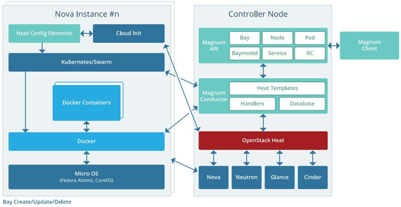

# OpenStack Magnum (Container as a Service)
Magnum 由 OpenStack Container Team 開發的容器編配引擎（Container Orchestration Engines），在 OpenStack Liberty 版本正式被釋出第一版，Magnum 透過與 OpenStack 的幾個核心服務整合來提供容器的叢集部署與編配。採用 Magnum 有以下幾個特色：
* **Provisioning**。
* **Provides REST APIs**
* **Scale in/out Bay**。
* **Manage container via Docker Swarm**。
* **Manage container via Kubernetes**。
* **Manage container via Mesos**。
* **Support Docker Swarm auto scale**。
* **Support Kubernetes HA**。

目前 OpenStack Magnum 為使用者提供了現今主流的幾個管理容器的叢集系統：
* **Kubernetes**：Google 開源自動化容器叢集管理系統。
* **Docker Swarm**：Docker 原生的叢集管理系統，採用原生網路來進行跨域的管理。
* **Apache Mesos**：Apache 基金會的開源叢集管理工具，將主機的 CPU、記憶體、儲存裝置以及其他資源抽象來提供資源。

Magnum 目前剛在 Liberty 版本正式從孵化專案畢業，許多功能還沒有很完全，但已足夠提供基本需求給使用者。使用者可以透過 Magnum 直接管理 Kubernetes、Docker Swarm 與 Apache Mesos 等叢集。主要透過後台的 COE（Container Orchestration Engine）來與容器叢集系統進行互動取得容器服務。Magnum 架構如下圖所示：

從架構圖可以看到 Magnum 有許多專有名詞，我們將針對一些比較重要的名詞與其功能進行說明。主要有以下：
* **Bay**：在 Magnum 中 Bay 被用來表示一個叢集單位，比如說建立一個 kubernetes 與 Swarm 的叢集。
* **Baymodel**：可以當作是 Flavor 的一種擴展，Flaovr 是定義 OpenStack 虛擬機的資源規格，然而 Baymodel 則是定義一個 Docker 叢集的規格，例如使用的 Image、運算節點的機器規格等。
* **Node**：主要指一個 Bay 中要被建立的節點數，可定義包含 Master 與 Minion（Slave） 節點數量。
* **Container**：指一個容器叢集的具體執行的 Container 數量。

至於其餘如 Pod、Replication Controller 與 Service 的概念是來至於 Kubernetes，其意思雷同，以下簡單描述代表含義：
* **Pod**：是一個最基本的部署呼叫單元，可表示多個容器，從邏輯來說就是一個應用程式的實例。
* **Service**：為 Pod 實際應用程式服務的抽象，每一個服務後面會有許多 Pod 來提供應用程式，而服務透過 Proxy與 Service selector 來決定服務請求傳遞給後台提供服務的容器。
* **Replication Controller**：為 Pod 的副本控制器，當 Pod 中的容器故障時，會自動的在原本或其他節點重新啟動容器。
